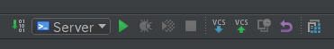
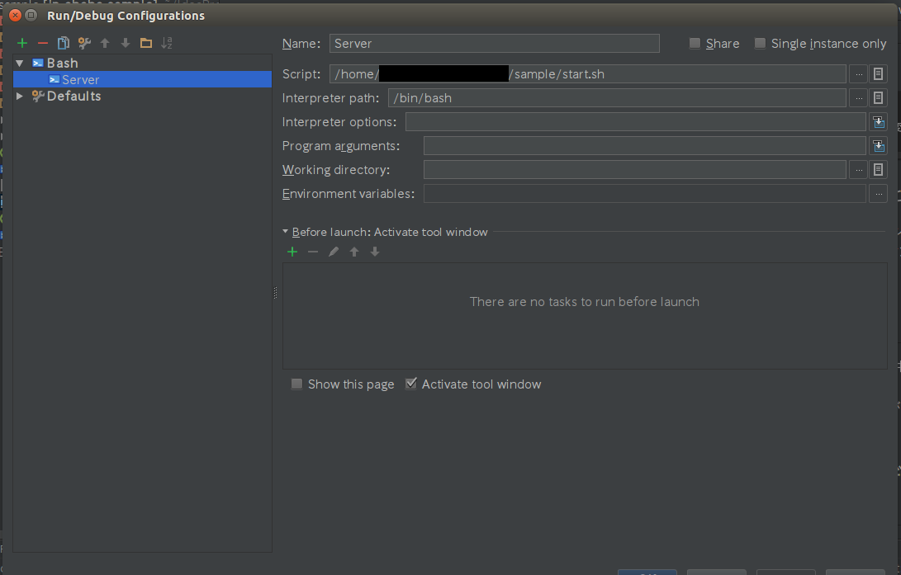

# Java Web Server テンプレート

## 使用ツール
- Gradle
- Shell Script
- PowerShell
- IntelliJ IDEA（おすすめ IDE）

## 使用ライブラリ
- Jetty Server 9.3.13.M0
- Jetty websocket 9.3.13.M0
- lombok (コーディング支援ライブラリ) 1.14.4
- eclipselink (JPA DBアクセスライブラリ) 2.6.4
- mysql-connector 5.1.38
- jersey (JAX-RS REST-APIライブラリ) 2.22.1
- gson (JSON変換ライブラリ)
- Java Servlet

## 概要

Web Servlet3 を使うことが出来る Jetty Webサーバを簡単に作るためのテンプレート。
Java EE で Web サーバを書くために必要な基本的なライブラリを取得するように設定しています。

## 手順(MacOS / Ubuntu 14.04 LTS版)
1. このリポジトリをクローン
2. `$ ./start.sh` でシェルスクリプトを起動
3. localhost:8080 にブラウザでアクセス
4. localhost:8080/sample にブラウザでアクセス

## 手順(Window 版)
1. このリポジトリをクローン 
2. start.ps1 を右クリック
3. PowerShell で実行を選択
4. コマンドプロンプトが表示され、実行するかを聞かれるので、R(一度だけ実行)を入力しEnter
5. localhost:8080 にブラウザでアクセス
6. localhost:8080/sample にブラウザでアクセス

※実行するかを聞かれなくする方法もあるので、また Qiita に書きます(2016/10/05)

## シェルスクリプトについてのマニュアル

./start.sh [オプション] [ファイル名]

    オプション    
    -n 出力後ファイル名（build.gradle:L13）の名前を変更している場合に使用
    -c なんかおかしくなった時用。コンパイル後ファイルを削除して、再コンパイルする

### シェルスクリプトで実行していること

- プロジェクトのソースコードを war ファイルにコンパイルする
- 出来上がった war ファイルを `java -jar` コマンドで実行する

## メリット

- Jetty を利用しているため、Java Webサーバの中では起動が高速。
- sh ファイルを実行する・ps1ファイルを実行するだけでサーバの再起動ができるためデバックがしやすい

## デメリット
- ブレークポイントを打てない…！？

## IntelliJ の設定によって更にデバッグ高速化

下記のように start.sh を IDEA に登録しておけばボタンひとつでサーバの実行をすることが出来る。

|項目|値|
|:---|:---|
|Name|任意の名前|
|Script|ルートディレクトリから start.sh までのパス|
|Program_aguments|start.shに与えるオプション・引数（書き出し後ファイル名を変更している場合は必須）|
